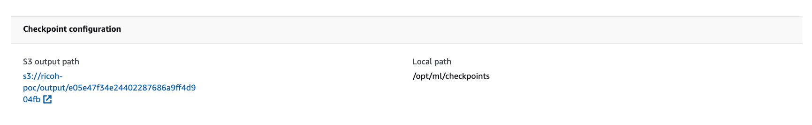
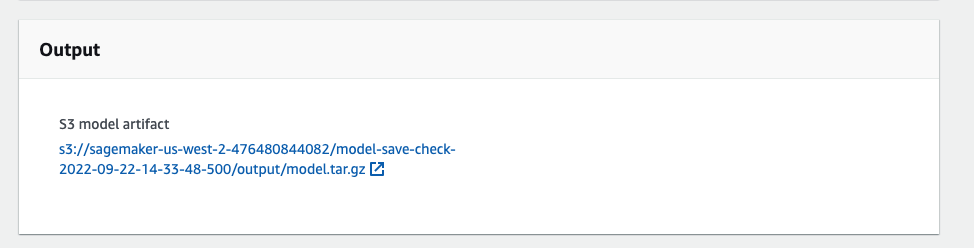

# 学習スクリプトについて

### 前回ご案内した言語モデル学習環境


### データの準備(Optional)

データは HuggingFace の [allenai/C4](https://huggingface.co/datasets/allenai/c4) のデータセットを想定しています。また、実行環境 としてFSx for Lustre をマウントした EC2 での実行を想定しています。ライブラリのインストールには、`requirements.txt` を活用下さい。

PoC 用の Bucket に HuggingFace から RAW データをダウンロードした上で前処理を施します。
RAW データの保存先と前処理後のデータの保存先を指定し、`data_prep_concat.py` を実行します。

```Python
RAW_DATA_DIR = "<fsx_mount_dir>/ns1/ja_raw_data"
SAVE_DIR = f"<fsx_mount_dir>/ns1/ja_megagon_preprocessed_{BLOCK_SIZE}"
```

### 学習の実行

SageMaker 学習ジョブを起動できる環境をご用意下さい。
学習ジョブの起動には、`create_train_job_gptj.py` を活用します。学習ジョブ内では、`train_gpt_simple.py` が実行されます。
`create_train_job_gptj.py` で活用されるAWS環境の情報については、実行環境に合わせて `config_sample.json` を編集して活用します。

```Json
{
    "aws_config": {
        "role": "arn:aws:iam::<aws_account_id>:role/service-role/AmazonSageMaker-ExecutionRole-<role_id>"
    },
    "fsx_config": {
        "subnets": ["subnet-<subnet_id_1>", "subnet-<subnet_id_2>"], 
        "security_group_ids": ["sg-<security_group_id>"],
        "file_system_id": "fs-<file_system_id>",
        "train_directory_path": "/<fsx_mountname>/<path>/<to>/<train_dir>",
        "validation_directory_path": "/<fsx_mountname>/<path>/<to>/<validation_dir>"
    }
}
```

`train_gpt_simple.py` では学習の実行内容に合わせてハイパーパラメーターを調整します。よく変更しそうなものは大文字でスクリプト内に記載してあります。下記以外のパラメーターもご自由に変更下さい。

```Python
# GPT-J モデル設定
MODEL_NAME = "gpt-j"
MAX_CONTEXT_WIDTH = 20
NUM_LAYERS = 2

# よく変更する学習ジョブ設定
N_INSTANCE = 1
MAX_STEP = 500
TP_DEGREE = 8
ACTIVATION_CHECKPOINTING = 1
BATCH_SIZE = 8

INSTANCE_TYPE = "ml.p4d.24xlarge"
VOLUME_SIZE = 1024
```

実行環境にて `python3 create_train_job_gptj.py` で SageMaker の学習ジョブを起動します。

#### 注意事項

実行時間を `MAX_RUN` で秒単位で制限できます。現在は 1日 = 24×60×60 秒で学習ジョブが終了されるように設定してあります。数日を想定するような学習ジョブでは、適切に時間(秒) を設定下さい。

### 保存されたモデルの確認

学習ジョブが起動すると、SageMaker コンソールにて学習ジョブの進捗を確認することができます。
学習途中のモデルは、SFx for Lustre がリンクしている S3 バケットの `checkpoint` ディレクトリに、



学習終了時のモデルはファイルが、tar.gz で保存された形で `output` ディレクトリにそれぞれ保存されています。



### 学習後のモデルファイルの確認

`full` の prefix で始まるモデルについては、評価にお使い頂けます。詳細は、`saved_model_check.ipynb` をご確認下さい。
